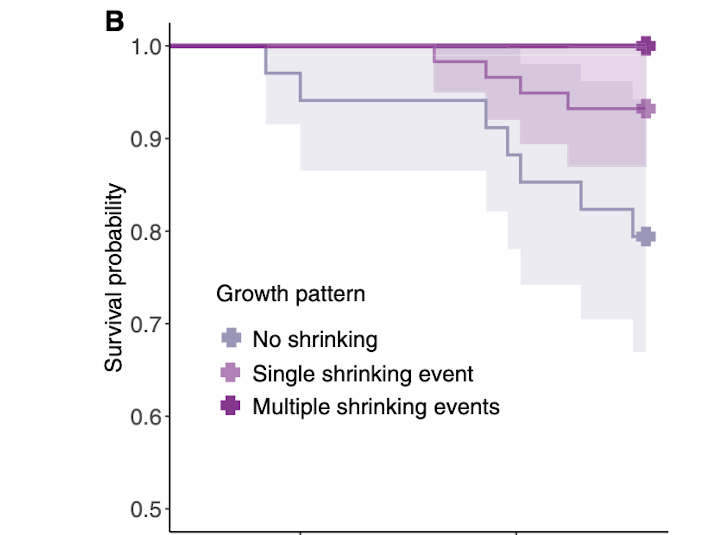

```{r}
#| label: setup
#| include: false

knitr::opts_chunk$set(
  echo = FALSE,
  message = FALSE,
  warning = FALSE
)

library(tidyverse)
library(here)
library(ggplot2)
```
## Plot Deconstruction

For this workshop, I chose a published figure from Versteeg et al. (2025). The study looked at changes in body size and survival in clown anemonefish during a marine heatwave.

The researchers measured 134 wild clown anemonefish from 67 breeding pairs over five lunar months in Kimbe Bay, Papua New Guinea. One of the main findings was that clown anemonefish were able to shrink during heat stress, and fish that shrank had a better chance of surviving.

## Original Plot

I selected Figure 5B from the paper. This panel compares the survival probability of clown anemonefish based on three different growth patterns.
```{r}
#| label: original_figure_5b
#| echo: false
#| out-width: "80%"
#| fig-cap: "Original Figure 5B from Versteeg et al. (2025), showing clown anemonefish survival probability for each growth pattern."


```

The three growth patterns shown in the figure are explained below

```{r}
#| label: growth_pattern_table

growth_pattern_table <- tibble(
  Growth_pattern = c(
    "No shrinking",
    "Single shrinking event",
    "Multiple shrinking events"
  ),
  Meaning = c(
    "Fish did not shrink during the study",
    "Fish shrank once during the study",
    "Fish shrank more than once during the study"
  )
)

knitr::kable(
  growth_pattern_table,
  caption = "Growth pattern categories used in the original Figure 5B."
)
```
## Visual Critique

The original plot shows an important ecological result, but I found it difficult to interpret quickly. This is partly because it is only one small panel within a much larger figure.

The survival curves and confidence ribbons overlap, which makes the differences between the groups harder to see. The colours also do not make the main result stand out clearly.

I thought the figure could be improved by making the survival panel larger, using clearer labels, simplifying the design and making the differences between the growth patterns easier to compare.

## Plot Deconstruction and Data Extraction

I first checked the original paper to see whether the data were publicly available. Versteeg et al. (2025) state that the data can be found in the paper, the supplementary materials and Zenodo.

For this workshop, I decided to manually digitise the figure because the aim was to rebuild the visual pattern shown in Figure 5B.

I estimated the survival probabilities at several important time points for each growth pattern. I then saved these approximate values in a CSV file called figure_5b_digitised.csv and imported the file into R.
## Rebuilt Plot

I used the digitised values to recreate the main survival pattern shown in Figure 5B.

My goal was not to completely reproduce the original statistical model. Instead, I wanted to redesign the figure so the main ecological result was easier to understand.
```{r}
#| label: rebuild-survival-plot
#| fig-cap: "Rebuilt version of the clown anemonefish survival plot from Versteeg et al. (2025), using manually digitised values from Figure 5B."

figure_5b_digitised <- read_csv(
  here::here("data", "workshop3", "figure_5b_digitised.csv"),
  show_col_types = FALSE
) |>
  mutate(
    growth_pattern = factor(
      growth_pattern,
      levels = c(
        "No shrinking",
        "Single shrinking event",
        "Multiple shrinking events"
      )
    )
  )

figure_5b_digitised |>
  ggplot(
    aes(
      x = day,
      y = survival_probability,
      colour = growth_pattern
    )
  ) +
  geom_line(linewidth = 1.2) +
  geom_point(size = 3) +
  scale_y_continuous(
    limits = c(0.5, 1),
    breaks = seq(0.5, 1, 0.1)
  ) +
  labs(
    title = "Clown anemonefish survival by growth pattern",
    subtitle = "Manually digitised from Figure 5B",
    x = "Time during study period (days)",
    y = "Survival probability",
    colour = "Growth pattern"
  ) +
  theme_minimal() +
  theme(
    legend.position = "bottom",
    plot.title = element_text(face = "bold")
  )
```
## Interpretation

The rebuilt figure makes the main result easier to see.

Clown anemonefish that did not shrink had the lowest survival probability. Fish that shrank once had a higher survival probability, while fish that shrank multiple times had the highest survival probability.

This pattern suggests that shrinking may act as a flexible response that helps clown anemonefish cope with stressful environmental conditions during a marine heatwave.

## Reflection

This workshop helped me understand how the design of a graph can affect the way scientific results are communicated.

The original figure contained strong scientific information, but the main pattern was difficult to see because the survival plot was small and included several overlapping elements.

By focusing on one panel, simplifying the layout and using clearer labels, I was able to make the main result easier to interpret.

I also learned that manually digitising a published figure can be useful when the goal is to examine and rebuild the visual pattern. However, the digitised values are only estimates and should not be treated as the exact original dataset.
